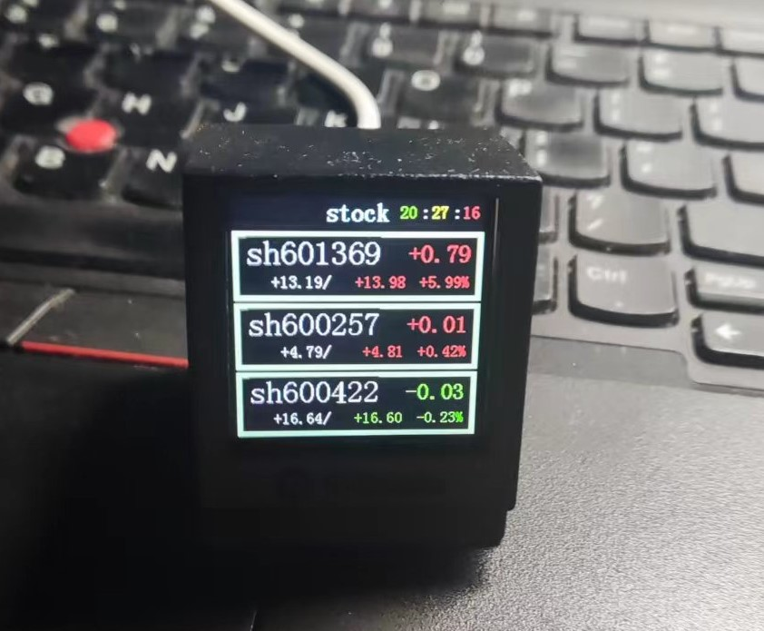

# wifi clock on pyClock opensource project

本项目源自网友 [nxnqh的code](docs/README_cn.md)

因为我想显示股票信息，对在原始代码架构上做了修改，增加了股票显示界面

## 目前修改的功能有：
1，为了节省空间，删除了winxp_ui

2，增加了对多个wifi热点的支持，可以修改/data/config/wifilist.cfg增加多个WiFi，但注意不要增加太多，有可能watchdog超时会在没找到wifi时重启

wifilist.cfg格式如下：

[ "{\"ssid\": \"SSID1\", \"password\": \"PASSWD1\"}","{\"ssid\": \"SSID2\", \"password\": \"PASSWD2\"}"]

3，增加了蓝牙接口，搜索pyClockBLE设备，通过uart发送以下命令增删股票（必须以sh、sz开头）

添加股票：   stock add:sh600000

删除股票：   stock del:sz000001 

通过uart发送以下命令增删wifi热点、
增加热点：   wifi add:ssid,password
删除热点:    wifi del:ssid