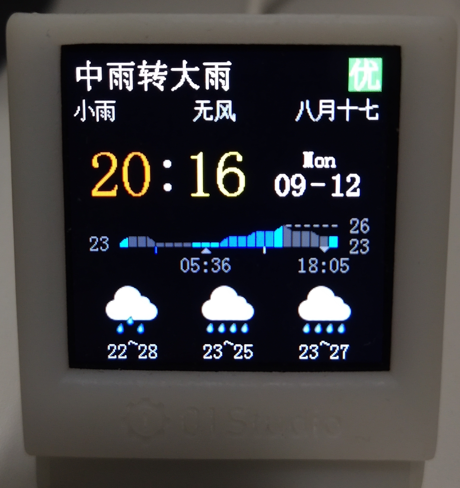

# this project is originally from a Outstanding contributions of User 'nxnqh' on 010studio.cc
I try to add some code in this framework

[original code](https://bbs.01studio.cc/thread/471)

## Original Readme

nxnqh
2022-07-24
1584
精华
UI：Winxp + WeatherClock
☛版本更新：

V4.6：（2022.10.24）新增 天气类型：雨夹雪；优化 部分功能。

V4.5：（2022.10.09）新增 气象预警：强季风、森林火险、草原火险、道路冰雪、道路积雪。

V4.4：（2022.10.03）优化 开机速度；优化 部分功能。

V4.2：（2022.09.24）微调 winxp UI界面；新增 系统异常时，模拟xp蓝屏界面。

V4.0：（2022.09.24）重构 所有代码；优化 系统升级的版本号判断；优化 其他功能。

V3.9：（2022.09.20）新增 气象预警 类型：霜冻；修复 解除天气预警后，依旧显示预警的bug。

V3.8：（2022.09.14）新增 天气预警 类型：地质灾害气象风险。

V3.7：（2022.09.12）同步 天气预警的最新格式；优化 WeatherClock UI 清除局部界面的性能。

V3.6：（2022.09.09）同步 百度天气的最新json格式（紧急）。

V3.5：（2022.09.05）新增 24节气信息；新增 本地计算农历、节日和节气算法；修复 部分bug。

V3.3：（2022.08.31）新增 农历及节日信息；修改 WeatherClock UI界面。

V3.2：（2022.08.31）优化 中文显示的内存占用；新增 WeatherClock UI界面字体。

V3.0：（2022.08.31）优化 系统升级；压缩 配置界面的画质。

V2.9：（2022.08.29）优化 WeatherClock界面；优化 部分功能。

V2.8：（2022.08.26）优化 WeatherClock界面。

V2.7：（2022.08.26）新增 WeatherClock UI的24小时温度数据、日出日落标记等；优化 WeatherClock UI的大雾指示颜色为黄；新增 每小时校准一次时钟。

V2.5：（2022.08.24）同步 百度天气的新数据格式（紧急）；新增 天气预警等级：森林草原火险；优化 程序更新的逻辑；优化 部分体验。

V2.4：（2022.08.01）优化 两个UI的雷阵雨天气图标。

V2.3：（2022.08.01）优化 WeatherClock UI。

V2.2：（2022.07.31）新增 开机检测更新。

V2.1：（2022.07.31）修复 WeatherClock UI的小bug。

V2.0：（2022.07.30）新增 自动更新功能（1小时检测1次。长按按钮2秒钟，可直接检测更新并显示日志页面的二维码）;优化 两个UI的大雨和暴雨天气图标；同步官方更新：WiFi账号支持空格和特殊字符；优化 部分体验；修正 少量bug。

V1.3：（2022.07.25）优化 看门狗的开启时间，配网时不启用看门狗；修正 一些小BUG。

V1.2：（2022.07.25）新增 切换UI之后记录UI编号，重启自动切换该UI；修正 显示汉字偶发的内存异常问题；修正 一些小BUG；关闭 获取数据异常时的提示灯。

V1.1：（2022.07.24）修正一些内存问题；优化灯的显示；新增 数据异常重启。

UI 模拟Win XP系统，相对还原了XP的开机界面和系统软件界面。

共制作了两个数据显示界面：

Winxp
WeatherClock
WeatherClock在原默认界面上，新增了未来3天 天气、未来24小时 天气和温度、农历和节日信息。（彩色条显示未来24小时的天气和温度。 橙色：晴。 灰色：阴天或多云。 蓝色：下雨，颜色越深雨越大。 白色：雪。黄色：雾。）

按钮功能：

短按，切换界面
长按2秒，系统更新界面
长按6秒，重置Wifi和城市数据
界面上数据包括：

时间、日期、星期；
实时 天气预警；
实时 天气，温度，空气质量；
今天（明天、后天） 天气，温度；
未来24小时天气和温度；日落日出；农历和节日（WeatherClock独有）
天气界面，每10分钟刷新一次天气，并每小时检测一次系统更新（手动切换到更新界面后，每10分种检测一次更新）和同步最新时间。看门狗超时时间为60秒。

更新界面上的二维码是本贴的地址，可用于查看更新日志，或手动下载代码。

切换UI后（最后一次切换后，1分钟内无再次切换的操作），记录用户当前的UI，重启后自动切换该UI。

调试时可把PyClock类中的__isUseWdt参数设为False，即可关闭看门狗。

PS：如果自动更新 多次重试都失败，请在本界面下载最新的附件 进行手动更新。（V4.0更改了升级逻辑，4.0之前的版本如果更新失败，请直接手动升级到4.0后的版本。）

概括的安装方法：
删除小电视根目录下的所有文件。解压缩下载的附件，把source code中的所有文件复制到小电视根目录即可。

关于 电脑如何连接小电视 及 需要什么软件：
客服发的资料中，有个PDF叫《MicroPython从0到1》基于pyClock天气时钟_v1.0--01Studio编著。具体可以参考这本书的第三章。

详细的安装方法：
大概是这样：在win10的电脑上安装Thonny软件，把小电视插到电脑上，配置这个软件 并用软件连接小电视（配置解释器为：Esp32，端口对应设备的端口）。连接后，软件左上角是本地目录，左下角是小电视里的目录（如果没有文件界面，软件左上角点击“视图”，勾选“文件”即可）。因小电视自带的程序 设定了30秒无响应会自动重启，所以首次连接后 需在30秒内注释掉看门狗 或 直接删掉小电视目录下的所有文件。（因为如果超过30秒，设备会自动重启。需要把小电视拔下来重插电脑，然后软件里重新连接）注释掉看门狗或删代码后，记得把小电视拔下来重插电脑，软件中重新连接。最后一步，删除小电视的所有文件，把下载的压缩包解压缩，打开source code文件夹，复制source code下的所有文件到小电视的根目录。再重启小电视即可。

